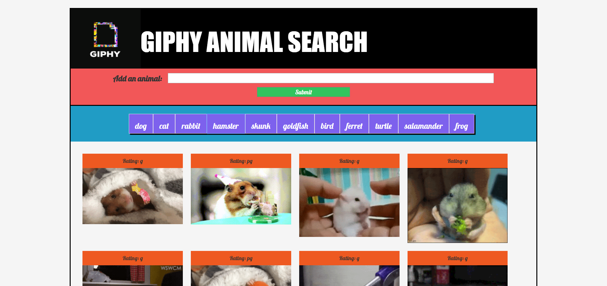

# GifTastic

## Overview
A dynamic web application that utilizes the GIPHY API to populate gifs of animals of the user's choice. 
<ul>
	User is able to add new "animal buttons" and can then be clicked to view gifs of animals. 
</ul>
<ul>
	Clicking on the respective animal buttons will present the user with multiple gifs of the animal.
</ul>
<ul>
	JavaScript and jQuery is used to update the HTML. 
</ul>

## Illustration: homepage

## Technology Used:
<ul>HTML</ul>
<ul>CSS</ul>
<ul>JavaScript</ul>
<ul>jQuery</ul>
